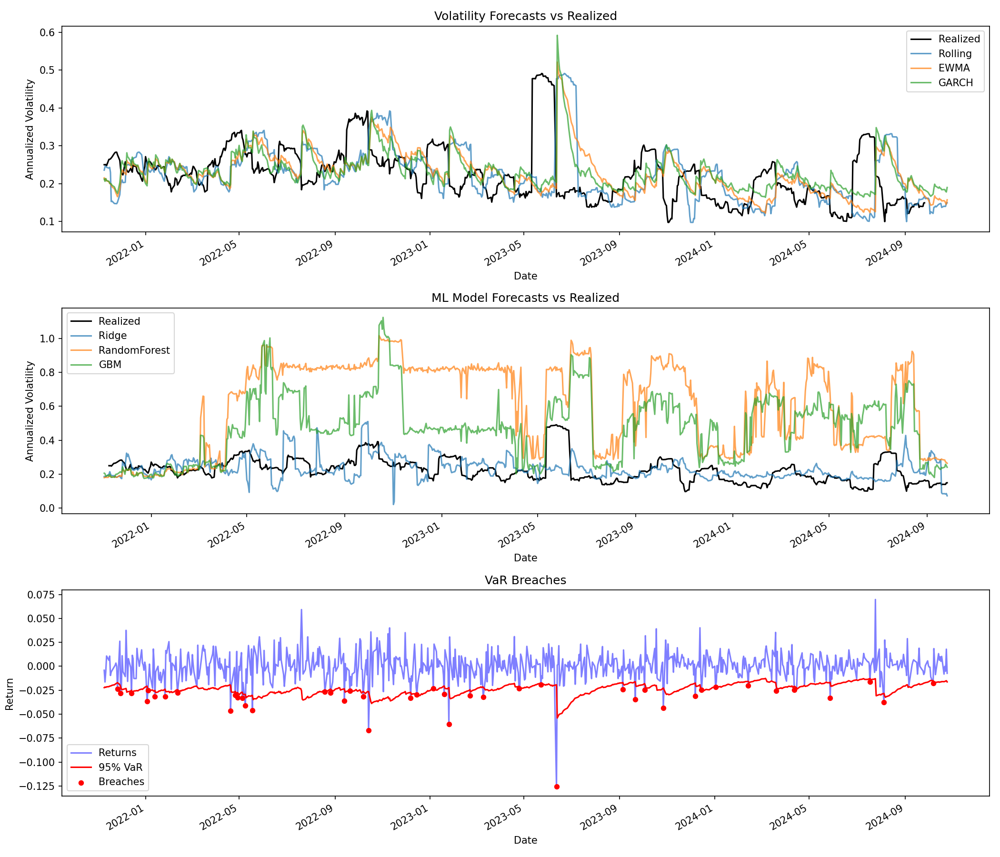

# Volatility Risk Lab


A volatility forecasting system that compares traditional econometric methods against machine learning models for portfolio risk estimation.

## The Question

**Can I predict tomorrow's volatility better than naive methods, and use that prediction to estimate portfolio risk?**

## Results



| Model        | MAE       | RMSE      | MAPE      |
| ------------ | --------- | --------- | --------- |
| **GARCH**    | **0.066** | **0.090** | **31.79** |
| Ridge        | 0.068     | 0.089     | 32.34     |
| EWMA         | 0.070     | 0.095     | 32.91     |
| Rolling      | 0.075     | 0.104     | 34.85     |
| GBM          | 0.257     | 0.313     | 130.85    |
| RandomForest | 0.390     | 0.455     | 190.16    |

**Key Findings:**

- GARCH(1,1) outperformed all methods with lowest MAE
- Ridge regression nearly matched GARCH, suggesting features have signal
- Tree-based models (RF, GBM) massively overfit on limited time series data
- VaR backtest showed 5.62% breach rate vs 5% expected (ratio: 1.12)

## Pipeline

```
NASDAQ Daily Data (2010-2024)
         ↓
    Log Returns
         ↓
  Volatility Models:
    • Rolling Window (baseline)
    • EWMA (λ=0.94)
    • GARCH(1,1)
    • ML (Ridge, RF, GBM)
         ↓
   Risk Metrics (VaR, CVaR)
         ↓
   Evaluation & Backtesting
```

## Project Structure

```
vol-risk-lab/
├── config.py              # Constants and paths
├── main.py                # Run the full pipeline
├── src/
│   ├── data_loader.py     # Load and preprocess data
│   ├── features.py        # Rolling vol, lagged returns
│   ├── risk_metrics.py    # VaR, CVaR calculations
│   ├── evaluation.py      # Model comparison
│   ├── backtester.py      # Walk-forward testing
│   └── models/
│       ├── ewma.py        # EWMA volatility
│       ├── garch.py       # GARCH(1,1)
│       └── ml_vol.py      # Ridge, RF, GBM
├── notebooks/
│   └── 01_eda.ipynb       # Exploratory analysis
├── tests/
│   └── test_risk_metrics.py
└── data/
    ├── raw/nasdq.csv
    └── processed/
        ├── results.png
        └── model_comparison.csv
```

## Data

- **Source:** NASDAQ daily data
- **Period:** 2010-01-05 to 2024-10-25 (~3,900 trading days)
- **Features:** OHLCV, VIX, Interest Rate, Exchange Rate, TED Spread, EFFR, Gold, Oil

## Installation

```bash
git clone https://github.com/Hussain0327/vol-risk-lab.git
cd vol-risk-lab
python -m venv venv
source venv/bin/activate
pip install -r requirements.txt
```

## Usage

Run the full pipeline:

```bash
python main.py
```

Run tests:

```bash
pytest tests/ -v
```

## Methods

### EWMA (Exponentially Weighted Moving Average)

```
σ²_t = λ * σ²_{t-1} + (1-λ) * r²_{t-1}
```

λ = 0.94 (RiskMetrics standard). Recent observations get more weight.

### GARCH(1,1)

```
σ²_t = ω + α * r²_{t-1} + β * σ²_{t-1}
```

Fitted params: α = 0.073, β = 0.897, α + β = 0.97 (high persistence)

### VaR Backtesting

95% VaR should be breached ~5% of the time. My EWMA-based VaR had a 5.62% breach rate (ratio: 1.12), which is acceptable.

## What I Learned

1. **GARCH still wins.** For volatility forecasting, traditional econometric methods remain competitive. This aligns with academic literature.

2. **Tree models overfit on time series.** RF and GBM predicted 80%+ volatility when realized was 30%. Limited data + high variance = bad.

3. **Simple features work.** Ridge with basic features (lagged vol, lagged returns, VIX) nearly matched GARCH.

4. **VaR backtesting matters.** A model can have low MAE but still underestimate tail risk. Always backtest.

## Requirements

```
pandas>=2.0
numpy>=1.24
matplotlib>=3.7
seaborn>=0.12
scikit-learn>=1.3
arch>=6.0
pytest>=7.0
```

## License

MIT
